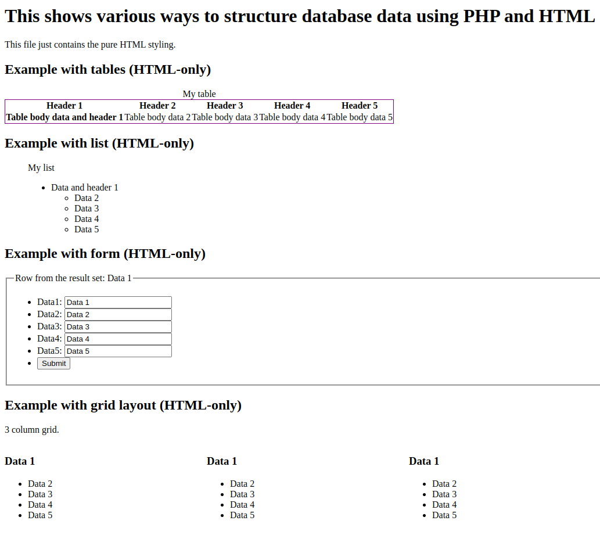

This code shows various ways to structure database results using PHP and HTML, together with the SQLite file example.db. Minimal CSS styling is applied.

The code includes the following examples:
* **Example with tables:** This example shows how to display database results in a table.
* **Example with list:** This example shows how to display database results in a list.
* **Example with form:** This example shows how to display database results in a form.
* **Example with grid layout:** This example shows how to display database results in a grid layout.

To run the code, follow these steps:

1. Create a SQLite database called example.db.
2. Import the example.sql file into the database.
3. Open the index.php file in a web browser.

You should see a page that displays the database results in a table, a list, a form, and a grid layout.

**Additional notes:**

* The code uses the htmlspecialchars() function to escape all output to prevent cross-site scripting attacks.
* The generated HTML code yields no errors or warnings when runned through [W3C Markup validation Service](https://validator.w3.org/).

**Pictures and videos**

[Show script running](screencast.webm)